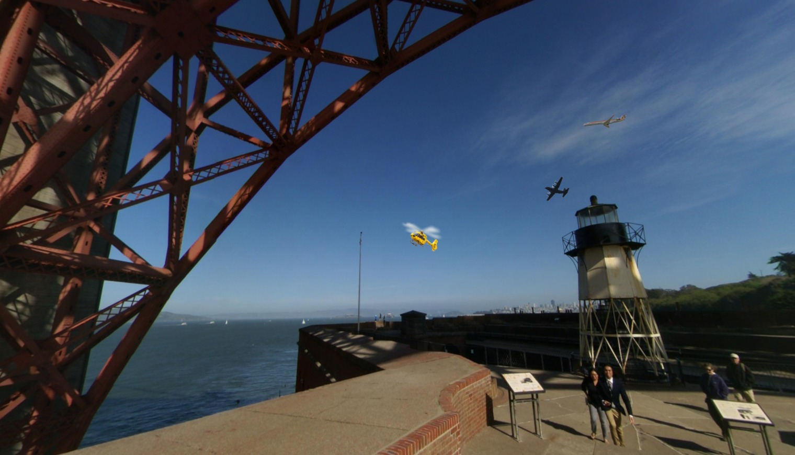

# CV

TODO!

## Input

1. Image containing several targets e.g.
   
2. A caption describing a specific target in the image. e.g.
   `"yellow helicopter"`

Note that images are provided as 1520x870 JPG files.

## Output

List of 4 integers corresponding to the bounding box of target identified by the caption within the image in left-top-width-height (LTWH) format.

Example: `[764, 420, 80, 60]`

        You should return a list of predictions in this format:

        ```
        [
            {
                "bbox": [x, y, w, h],
                "category_id": category_id
            },
            ...
        ]
        ```

        where:
        - `(x, y)` are the coordinates of the top left corner of the predicted
          bounding box,
        - `(w, h)` are its width and height in pixels, and
        - `category_id` is the index of the predicted category of the enclosed
          object.

        Note that all bounding box coordinates are 0-indexed. That is, if
        `(x, y) == (0, 0)` then the top left corner of your bounding box is the
        top left corner of the image.
